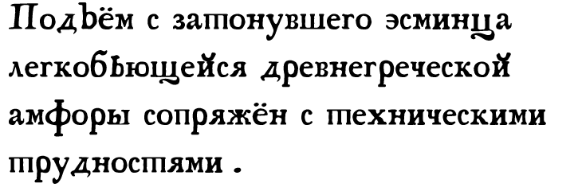
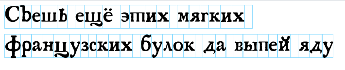
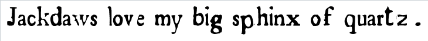
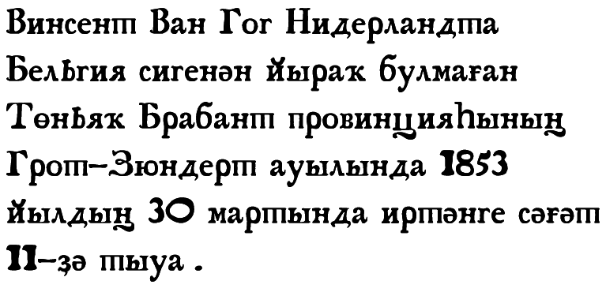
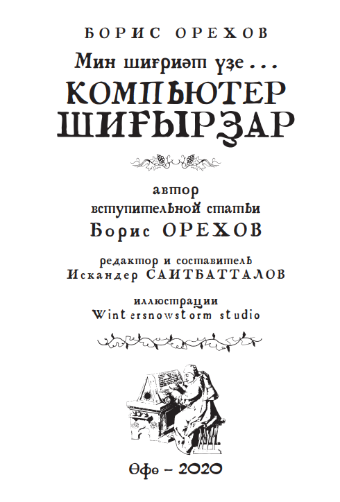
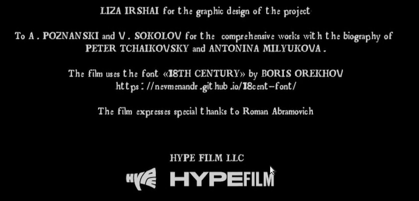
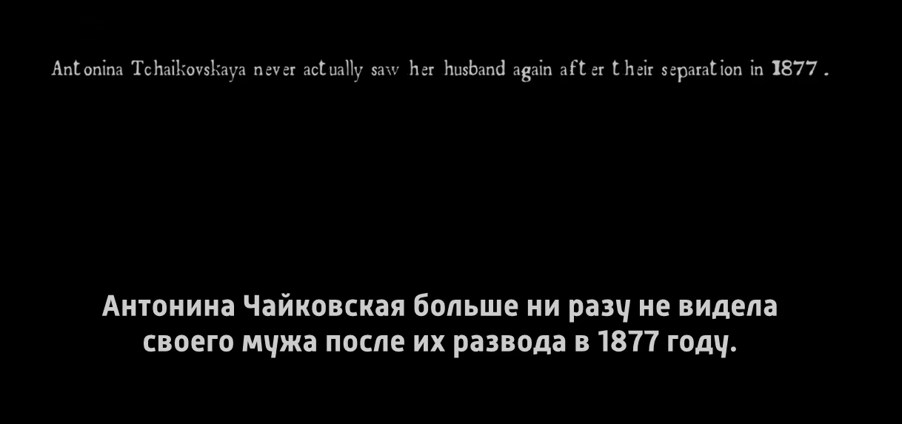
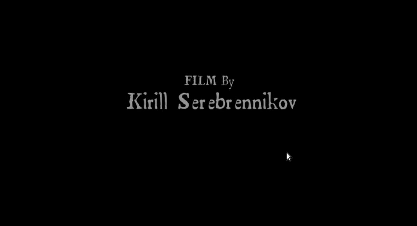
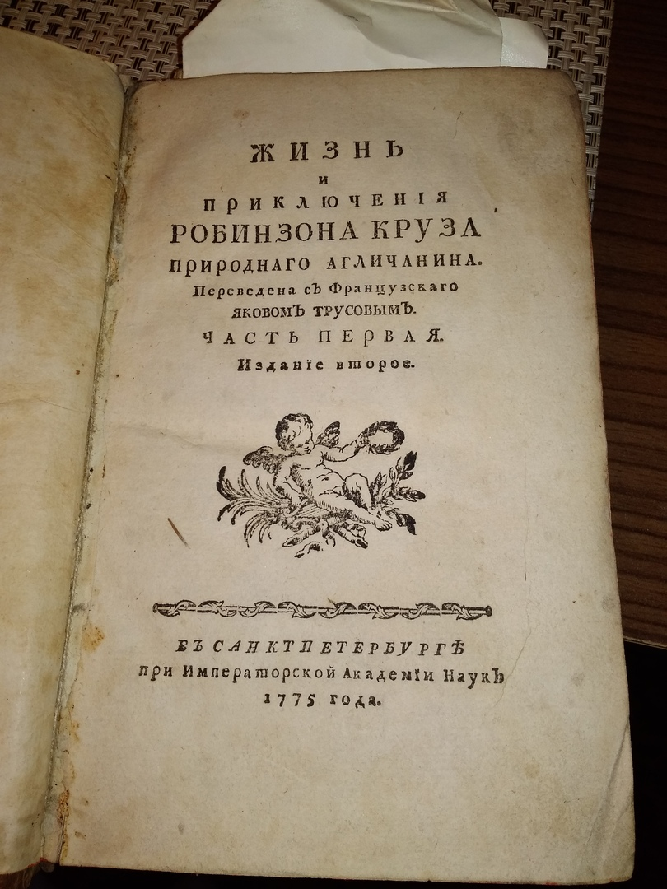

# Описание

Кириллическая часть шрифта «18 век» разработана на основе книги [Жизнь и приключения Робинзона Круза природнаго агличанина](https://search.rsl.ru/ru/record/01003340206), изданной в 1775 году в типографии Императорской академии наук.

Буквы воспроизводят несовершенство технологии печати XVIII века и воссоздают колорит работы со старопечатными книгами.

# Примеры начертания

Шрифт подходит как для оформления полиграфической продукции, так и для веба.

В шрифте есть также символы латиницы

В таблице символов можно найти и некоторые кириллические символы, необходимые для печати текста на языках народов России (полностью воспроизведены символы из башкирского алфавита):

# Портфолио

Гарнитура использовалась для набора книги [ Орехов Б. В. Мин шиғриәт үҙе... Компьютер шиғырҙар / вступ. статья Б. Орехова, ред. и сост. И. Саитбатталов. — Өфө: Мир печати, 2020. — 72 с.](http://nevmenandr.net/personalia/Min_shigriet_yze.pdf)

Шрифт использован в титрах фильма «[Жена Чайковского](https://www.kinopoisk.ru/film/764739/)»

# Лицензия и условия использования

Шрифт распространяется под открытой лицензией GPL 3.0 свободно и бесплатно.

[Борис Орехов](http://nevmenandr.net/bo.php) и Динис Муслимов в 2020 году.
